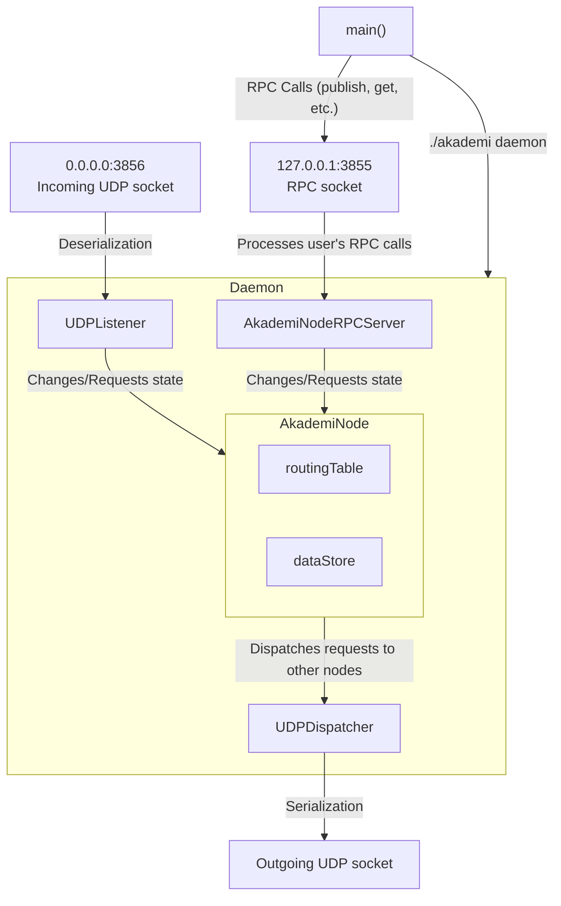

# Akademi

Akademi is a [Kademlia](https://en.wikipedia.org/wiki/Kademlia) implementation written in Go. The nodes of Akademi communicate with each other via UDP messages in [Protocol Buffers](https://protobuf.dev/).

## Quick Start

To get started with Akademi clone the repo and run make, a binary file will appear in the root of the project.

1. Clone the project.
```
$ git clone https://github.com/gsergey418alt/akademi
```
2. Install development dependencies.
```
$ sudo apt install go protoc
$ go install google.golang.org/protobuf/cmd/protoc-gen-go@latest
```
3. Build it.
```
$ make
```
4. Start the daemon.
```
$ ./akademi daemon
```

## Usage

Akademi uses 40-bytes base32-encoded IDs that identify nodes and data on the network. They look like this: ```QSWTYJD3HPOE54DWURBPICK7FAWWMVD3```. To store data on the network, you have to run the publish command and provide up to 4KiB of data you want to store:

```
$ ./akademi publish https://github.com/gsergey418alt/akademi
Data published to the DHT successfully. KeyID: NB2HI4DTHIXS6Z3JORUHKYROMNXW2L3H.
```

The data will be stored on the DHT. To fetch it later use the get command and provide the key ID from the previous command:

```
$ ./akademi get NB2HI4DTHIXS6Z3JORUHKYROMNXW2L3H
Data retreived from the DHT successfully.
Content:
https://github.com/gsergey418alt/akademi
```

The data is usually stored on the DHT for up to an hour, after that it needs to be republished.

## Docker

There's an option to run an akademi network simulation in docker with 3 bootstrap nodes and 100 regular nodes. To start it run make swarm. (You need to have docker installed on your system)
```
$ make swarm
```

Use the docker exec command to interact with the containers:

```
$ docker exec akademi_1 akademi publish "Hello, World!"
Data published to the DHT successfully. KeyID: JBSWY3DPFQQFO33SNRSCDWRZUPXF422L.
```

You can also run a regular akademi node from a docker image.

```
$ make docker
$ docker run --name akademi --rm -d -p 3865:3865 -p 127.0.0.1:3855:3855 ghcr.io/gsergey418alt/akademi:latest
```

## Technical Details

When started, Akademi opens ports 3855 on the localhost and 3865 on all interfaces. The first one is used for communication with the CLI via RPC, and the second one for communicating with other nodes. Akademi has three main modules responsible for the core functionality: AkademiNode, Listener and Dispatcher. They communicate with each other via interfaces in the following way: AkademiNode holds the core Kademlia logic regarding routing and data storage, it is used by the Listener to react to incoming requests from other nodes, which is a one-way relationship from the Listener to AkademiNode. Meanwhile, AkademiNode holds an instance of the Dispatcher interface, that is used for dispatching UDP messages to other nodes, which is also a one-way relationship. These packages all depend on core types held in the "core" package and protocol buffer definitions in the package "pb". In regards to the core Kademlia logic, this software mostly adheres to the original whitepaper. Information on the network is stored as bytes with a maximum length of 4KiB. They are addressed via base32-encoded SHA1 hashes of their content, which is computed on write. Values in storage expire after one hour. This wasn't built with account for any persistence, so all the data and routing information is stored in memory.



## Running Tests

To run tests on the project, launch the daemon in standalone mode and run make test.

1. Run the daemon
```
$ ./akademi daemon --no-bootstrap
```
2. Run the tests
```
$ make test
```